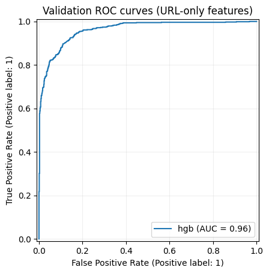
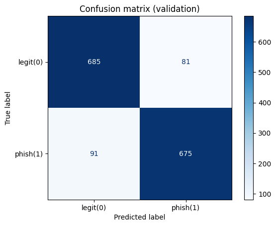
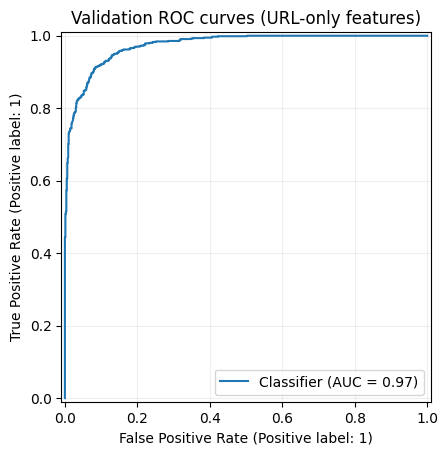
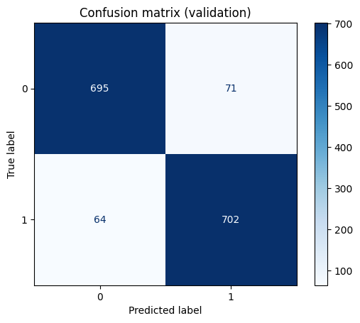

# Model Training & Data Preprocessing Report (URLs + Images)

Repository: `ml-2-url-img-classifier`  
Generated: 2026-03-14

## 1) Executive summary

This repo trains phishing detectors from:

- **URLs** (tabular + token/embedding features), primarily using the Hugging Face dataset `pirocheto/phishing-url`.
- **Website screenshots** (images), using a local copy of the Zenodo dataset `8041387` (binary: phishing vs not-phishing).

The strongest URL results come from **pre-existing engineered features** provided by the Hugging Face dataset (87 numeric columns), where a histogram gradient boosting model reaches **ROC-AUC ~0.995** on the dataset’s held-out test split. When restricted to **URL-only features** derived directly from the URL string (39 features), validation ROC-AUC drops to ~0.955; adding a **Word2Vec URL-token embedding** increases validation ROC-AUC to ~0.974.

For images, a simple PyTorch CNN trained on resized screenshots reaches **~0.933 validation accuracy** after 7 epochs (no separate test evaluation in the notebook).

## 2) Repository layout (relevant artifacts)

### URL classification

- Training/eval code (baseline on HF-provided numeric features): `src/hf_phishing_url/`
  - Dataset loading + label mapping: `src/hf_phishing_url/data.py`
  - Model candidates + metrics: `src/hf_phishing_url/train.py`
  - End-to-end experiment + bundle saving: `src/hf_phishing_url/experiment.py`
- CLI-like runner: `scripts/train_hf_phishing_url.py`
- Notebooks:
  - Baseline metrics on HF numeric features: `notebooks/baseline-metrics.ipynb`
  - URL-only feature model: `notebooks/train-standard-features.ipynb`
  - URL-only + Word2Vec embedding: `notebooks/train-standard-and-embedding.ipynb`
  - Word2Vec module demo: `notebooks/example-word2vec-module.ipynb`
- Saved models:
  - URL-only features: `models/url_clf_features_only.joblib`
  - URL-only + Word2Vec embedding: `models/url_clf_w_embedding.joblib`
  - Baseline (bundle: metadata + best pipeline): `artifacts/hf_pirocheto_phishing_url.joblib`
- Plots referenced in `notes.md`:
  - `graphs/ROC-manual-features.png`, `graphs/CF-manual-features.png`
  - `graphs/AUC-manual-features-embed.png`, `graphs/CF-manual-features-embed.png`

### Image classification

- Notebook training a CNN on screenshots: `notebooks/train-image-model.ipynb`
- Saved weights: `models/img_clf_model.pt`
- Legacy/partial attempt (TensorFlow, continued in Colab): `old-analysis/img-clf-test.ipynb`
- Note: `scripts/train_phishing_image.py` references a `phishing_image` module that is **not present** under `src/` in this repo.

### Legacy (older) URL work

- Older notebooks and code under `old-analysis/`:
  - `old-analysis/dataset_1_shashwatwork_9.41_89_column/baseline-url.ipynb`
  - `old-analysis/dataset_2_harisudhan411_9.41_2_column/dataset2_url_classifier.ipynb`
  - Feature/token extraction script: `old-analysis/dataset_2_harisudhan411_9.41_2_column/feature_extract.py`

## 3) URL classification: data, preprocessing, features

### 3.1 Dataset used (main)

Primary dataset is Hugging Face:

- Dataset id: `pirocheto/phishing-url` (see `src/hf_phishing_url/constants.py`)
- Label column: `status` with string classes `{phishing, legitimate}` mapped to `{1, 0}` by `map_labels()` in `src/hf_phishing_url/data.py`.

In `notebooks/train-standard-features.ipynb` and `notebooks/train-standard-and-embedding.ipynb`, the notebook loads `splits.train` and then performs a **stratified train/validation split** (`VAL_SIZE = 0.2`, `RANDOM_STATE = 42`). In `notebooks/baseline-metrics.ipynb` (and `scripts/train_hf_phishing_url.py`), training uses HF’s `train` split and final evaluation uses HF’s `test` split.

### 3.2 Baseline feature set: HF-provided numeric columns

The baseline code in `src/hf_phishing_url/data.py` infers features by:

- dropping the URL column `url` and label column `status`
- keeping columns that are numeric dtype

This yields **87 numeric features** in the saved artifact bundle (`artifacts/hf_pirocheto_phishing_url.joblib`).

Preprocessing in baseline pipelines (`src/hf_phishing_url/train.py`):

- `SimpleImputer(strategy="median")` for missing numeric values
- optional scaling for logistic regression (`StandardScaler()`)
- model candidates include:
  - Logistic Regression (`class_weight="balanced"`, `max_iter=3000`)
  - Random Forest (`n_estimators=400`, `class_weight="balanced_subsample"`, `n_jobs=-1`)
  - HistGradientBoostingClassifier (`learning_rate=0.1`)

Model selection criterion: **validation ROC-AUC** on a stratified split of the training split.

### 3.3 URL-only “standard features” extracted from the URL string

The URL-only feature extractor is implemented in `src/hf_phishing_url/feature_extraction.py` and used in:

- `notebooks/train-standard-features.ipynb` (numeric URL-only)
- `notebooks/train-standard-and-embedding.ipynb` (URL-only + embedding)

#### URL normalization and tokenization

Key steps (see `UrlTokenizer`):

- Normalize URL: if no scheme is present, prepend `http://`.
- Parse with `urllib.parse.urlparse`.
- Lowercase normalized URL, hostname, and path.
- Infer:
  - `tld`: last hostname segment (does not handle multi-part suffixes)
  - `subdomain`: everything before `domain.tld`
- Tokenize alphanumeric sequences via regex `[a-zA-Z0-9]+` across:
  - full URL (`raw_tokens`)
  - hostname (`host_tokens`)
  - path (`path_tokens`)
  - subdomain (`subdomain_tokens`)

#### Standard URL-only numeric features (39)

The URL-only model uses these numeric/boolean features (inferred from `URLFeatures` typing in `src/hf_phishing_url/feature_extraction.py`; booleans encoded as 0/1):

```text
length_url, length_hostname, ip,
nb_dots, nb_hyphens, nb_at, nb_qm, nb_and, nb_or, nb_eq, nb_underscore, nb_tilde,
nb_percent, nb_slash, nb_star, nb_colon, nb_comma, nb_semicolumn, nb_dollar,
nb_space, nb_www, nb_com, nb_dslash, nb_subdomains,
ratio_digits_url, ratio_digits_host,
http_in_path, tld_in_path, tld_in_subdomain,
prefix_suffix, path_extension,
shortest_words_raw, shortest_word_host, shortest_word_path,
longest_words_raw, longest_word_host, longest_word_path,
brand_in_subdomain, brand_in_path
```

Notes:

- `ip`: whether hostname parses as an IP address (`ipaddress.ip_address`).
- `brand_in_*`: checks tokens against a built-in brand list (e.g., `paypal`, `google`, `microsoft`, etc.).
- `path_extension`: detects a file-like extension in the last path segment (`.php`, `.html`, etc., length ≤ 5).

### 3.4 URL token embedding: Word2Vec pooled vector

The embedding transformer is `UrlWord2VecVectorizer` in `src/hf_phishing_url/word2vec_embedding.py`:

- trains a **gensim Word2Vec** model over token sequences produced by `UrlTokenizer`
- converts each URL into a fixed-size dense vector by pooling token vectors
  - default pooling: mean
  - default vector size: 100
- used via `ColumnTransformer` together with numeric features (see `notebooks/train-standard-and-embedding.ipynb`)

Important operational detail: because the Word2Vec model is trained inside the transformer’s `fit()`, it is learned from the training fold only (as part of `Pipeline.fit`).

## 4) URL classification: training procedures

### 4.1 Baseline training (HF numeric features)

Implemented in `src/hf_phishing_url/experiment.py` and executed by `scripts/train_hf_phishing_url.py`:

1. Load HF splits: `load_hf_splits()` → `train` and `test` dataframes.
2. Map labels: `status` → `{0,1}` via `map_labels()`.
3. Select numeric feature columns via `infer_feature_columns()`.
4. Create internal validation split from the training split (`val_size=0.2`, stratified).
5. Train candidate pipelines; select best by validation ROC-AUC.
6. Refit best pipeline on full training split; evaluate on HF test split.
7. Save bundle (metadata + model pipeline) to `artifacts/hf_pirocheto_phishing_url.joblib`.

### 4.2 URL-only feature training (notebook)

Implemented in `notebooks/train-standard-features.ipynb`:

1. Load HF training split.
2. Extract URL-only features from the URL string via `UrlFeatureExtractor.extract_many(urls)`.
3. Stratified train/validation split (`VAL_SIZE=0.2`).
4. Train a `HistGradientBoostingClassifier` on the URL-only numeric feature matrix.
5. Plot ROC curve and confusion matrix on the validation fold.
6. Save trained pipeline to `models/url_clf_features_only.joblib`.

### 4.3 URL-only + embedding training (notebook)

Implemented in `notebooks/train-standard-and-embedding.ipynb`:

1. Load HF training split.
2. Extract the same URL-only numeric features, but keep the raw `url` column too.
3. Build a `Pipeline`:
   - `ColumnTransformer`:
     - `UrlWord2VecVectorizer()` on column `url`
     - passthrough of the 39 URL-only numeric features
   - `HistGradientBoostingClassifier`
4. Stratified train/validation split (`VAL_SIZE=0.2`).
5. Train, evaluate on validation, plot ROC/confusion matrix.
6. Save pipeline to `models/url_clf_w_embedding.joblib`.

## 5) URL results and comparisons

### 5.1 Baseline (HF numeric features; 87 features)

From `notebooks/baseline-metrics.ipynb` and `artifacts/hf_pirocheto_phishing_url.joblib`:

- Best candidate: `hgb` (HistGradientBoostingClassifier)
- Validation metrics (internal split of HF train):
  - ROC-AUC: **0.9898**
  - Accuracy: **0.9543**
  - F1: **0.9544**
  - Precision: **0.9519**
  - Recall: **0.9569**
- Test metrics (HF test split):
  - ROC-AUC: **0.9948**
  - Accuracy: **0.9685**
  - F1: **0.9686**
  - Precision: **0.9638**
  - Recall: **0.9735**

Other candidates on validation (same notebook):

| model | ROC-AUC | accuracy |
|---|---:|---:|
| hgb | 0.9898 | 0.9543 |
| rf | 0.9878 | 0.9576 |
| logreg | 0.9804 | 0.9386 |

Interpretation: using the dataset’s rich engineered numeric feature set yields very strong separability.

### 5.2 URL-only standard features (39 features, derived from URL string)

From `notebooks/train-standard-features.ipynb` (validation fold):

| model | ROC-AUC | accuracy | F1 | precision | recall |
|---|---:|---:|---:|---:|---:|
| hgb | **0.9550** | **0.8792** | 0.8779 | 0.8879 | 0.8681 |

Validation plots:





Interpretation: performance drops relative to the baseline because only URL-syntax information is used (no page content or external signals).

### 5.3 URL-only + Word2Vec embedding (39 features + pooled Word2Vec)

From `notebooks/train-standard-and-embedding.ipynb` (validation fold):

| model | ROC-AUC | accuracy | F1 | precision | recall |
|---|---:|---:|---:|---:|---:|
| hgb | **0.9741** | **0.9119** | 0.9123 | 0.9082 | 0.9164 |

Validation plots:





Relative to URL-only numeric features:

- ROC-AUC: **+0.0191**
- Accuracy: **+0.0326**

Interpretation: token embeddings add lexical signal (brand-like tokens, suspicious words, etc.) beyond handcrafted counts/ratios.

### 5.4 “Current” vs “older” URL approaches in this repo

Legacy notebooks under `old-analysis/` use different datasets and are not directly comparable, but they show earlier baselines:

1. `old-analysis/dataset_1_shashwatwork_9.41_89_column/baseline-url.ipynb` (binary classifier; dataset read from a local CSV):
   - Accuracy: **0.88** (classification report shown in notebook output)
2. `old-analysis/dataset_2_harisudhan411_9.41_2_column/dataset2_url_classifier.ipynb` (large dataset; Word2Vec + lexical features + Linear SVM):
   - Accuracy: **0.90**
   - Confusion matrix printed:
     - `[[119563 10666], [15858 125171]]`

Feature/token extraction for that legacy SVM approach is described in:

- `old-analysis/dataset_2_harisudhan411_9.41_2_column/README.md`
- `old-analysis/dataset_2_harisudhan411_9.41_2_column/feature_extract.py`

Compared to those older baselines, the “current” URL work differs by:

- standardized use of HF dataset splits (`train`/`test`) for the main baseline
- explicit model selection by validation ROC-AUC
- a cleaner, reusable URL tokenizer + feature extractor (`src/hf_phishing_url/feature_extraction.py`)
- an embedding transformer that integrates into sklearn pipelines (`UrlWord2VecVectorizer`)

## 6) Image classification: data preprocessing and training

### 6.1 Dataset and folder layout

`notebooks/train-image-model.ipynb` expects a local dataset root:

- `DATA_DIR = /var/my-data/datasets/zenodo-8041387/data`

and scans:

- `not-phishing/*/screenshots/*.jpg`
- `phishing/*/screenshots/*.jpg`

The notebook prints class counts:

- not-phishing: **6000**
- phishing: **6000**

### 6.2 Preprocessing and loaders

Transform pipeline:

- resize to `(224, 224)`
- convert to tensor (`ToTensor()`)

Dataset class:

- `ScreenshotDataset` loads each JPG with PIL and converts to RGB.
- Labels: `0 = not-phishing`, `1 = phishing`.

Split strategy:

- random 80/20 train/validation split using `torch.utils.data.random_split`
- seed: 42

### 6.3 Model architecture and training loop

Model (`SimpleCNN` in the notebook):

- 2 convolution blocks:
  - `Conv2d(3→16, 3x3)` + ReLU + MaxPool2d(2)
  - `Conv2d(16→32, 3x3)` + ReLU + MaxPool2d(2)
- fully-connected head:
  - Flatten → Linear → ReLU → Linear(2 classes)

Training settings:

- loss: `CrossEntropyLoss`
- optimizer: Adam
- learning rate: `1e-3`
- batch size: `32`
- epochs: `7`
- device: uses CUDA if available

Model saving:

- `torch.save(model.state_dict(), "../models/img_clf_model.pt")`

### 6.4 Image results

From the printed training log in `notebooks/train-image-model.ipynb`:

- Validation accuracy improves to **0.9329** by epoch 7.

Note: the notebook does not define a separate test set or report ROC-AUC/precision/recall; it reports validation accuracy only.

### 6.5 Legacy image attempt

`old-analysis/img-clf-test.ipynb` shows an earlier TensorFlow approach using:

- `tf.keras.utils.image_dataset_from_directory` with an 80/20 split
- very large image size `(995, 1920)`
- training continued externally in a Colab notebook (link in the last cell)

## 7) Reproducibility notes and current gaps

- URL baseline is the most “production-ready” path: `scripts/train_hf_phishing_url.py` trains and saves a self-contained bundle.
- The URL-only notebooks save sklearn pipelines (`.joblib`) but do not evaluate on the HF `test` split; results shown are validation only.
- The image training lives only in a notebook; the repo includes `scripts/train_phishing_image.py` but its referenced package (`phishing_image`) is not implemented under `src/`.
- Several data paths in notebooks and legacy scripts are machine-specific (`/var/my-data/...`) and need to be parameterized or documented for portability.

## 8) How to run

### URL-only notebooks

Open and run:

- `notebooks/train-standard-features.ipynb`
- `notebooks/train-standard-and-embedding.ipynb`

They write trained pipelines into `models/`.

### Image notebook

Open `notebooks/train-image-model.ipynb` and update `DATA_DIR` to your local dataset path, then run all cells. It writes weights to `models/img_clf_model.pt`.

## 9) Future plans

### 9.1 Character-level CNN for URLs

Goal: add a **character CNN** that learns directly from the raw URL string, capturing obfuscation patterns (e.g., homoglyphs, long random paths, unusual delimiter usage) that may not be fully expressed by handcrafted counts or word-level tokens.

Proposed approach:

- **Input representation:** fixed-length character sequence (truncate/pad), with a defined charset (ASCII + common URL punctuation). Map chars → integer ids.
- **Model:** embedding layer + 1D convolutions with multiple kernel sizes (n-gram-like filters) + global max pooling + MLP classifier (binary).
- **Training/eval:** use the same HF split strategy as existing work, track ROC-AUC/precision/recall (recall prioritized per `other.md`), and compare against:
  - HF numeric-feature baseline (`notebooks/baseline-metrics.ipynb`)
  - URL-only features (`notebooks/train-standard-features.ipynb`)
  - URL-only + Word2Vec (`notebooks/train-standard-and-embedding.ipynb`)
- **Deliverable:** a runnable training script (mirroring `scripts/train_hf_phishing_url.py`) and a saved artifact (PyTorch or sklearn-compatible wrapper).

### 9.2 More (and more diverse) training data

Goal: improve robustness and reduce dataset-specific overfitting by training/evaluating across multiple sources.

Planned additions (already referenced in `resources.md`):

- **More URL datasets:** Kaggle datasets such as `harisudhan411/phishing-and-legitimate-urls` and `shashwatwork/web-page-phishing-detection-dataset`.
- **Multimodal dataset:** Zenodo `8041387` (URLs + HTML + screenshots) to support joint evaluation and future multimodal models.

Key preprocessing/experiment considerations:

- Deduplicate URLs across splits and across datasets to avoid leakage (e.g., same domain/URL appearing in train and test).
- Standardize label mapping and feature extraction so each dataset can be evaluated with the same pipelines.
- Add cross-dataset evaluation (train on one source, test on another) to measure real-world generalization.
